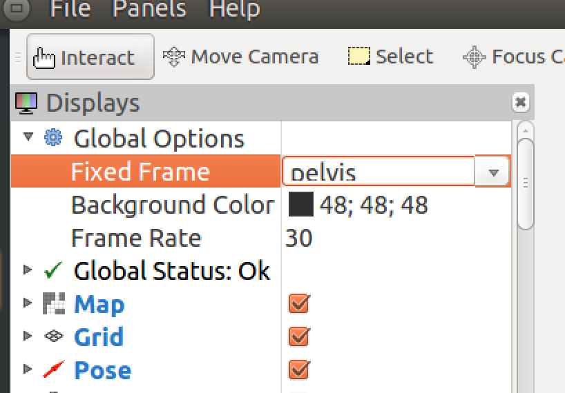
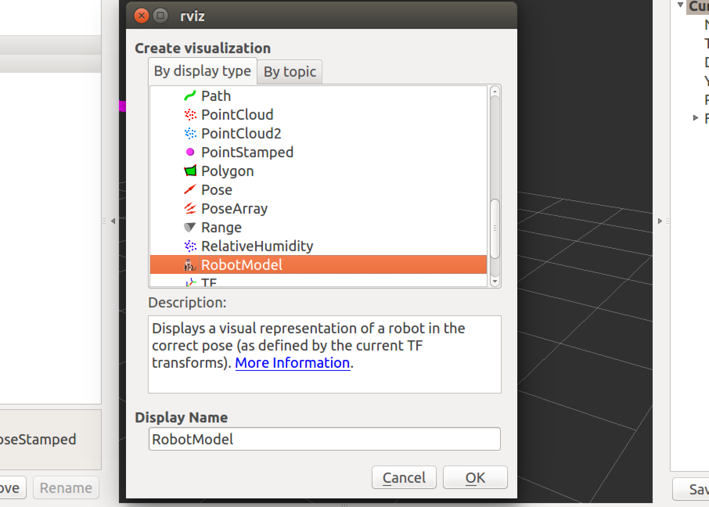
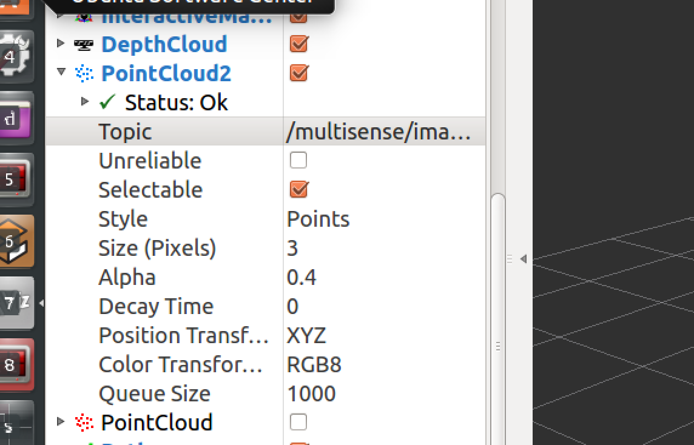

#RVIZ-Tutorial

##Install the RVIZ Repository
RVIZ is not shipped with ROS by default. 
To install it do the following

```sudo apt-get install ros-indigo-rviz```

If you are on another version of ROS do the following

```sudo apt-get install ros-<ROS-DISTRO>-rviz```

Where <ROS-DISTRO> is the flavor of ROS you are using.

Alternativly you can install RVIZ from source

```rosdep install rviz```

Followed by

```rosmake rviz```

## Starting the RVIZ interface

To start the interface you need to do the following with `roscore` running in the background

```source /opt/ros/indigo/setup.bash```

If the flavor of ROS that you are using is not `indigo` you will need to replace the `indigo` directory with the name of the flavor you are using.

Start RVIZ with the following command

```rosrun rviz rviz```

`rosrun` is the tool we use to start ROS nodes. RVIZ is the name of the node and the second rviz is the specific path to the launch file.


##Using RVIZ with your project

Once your ROS simulation is running along with `roscore` in the background you will be able to visualize what the robot is seeing in RVIZ.

On first load the robot will nto be visible. To be able to use the robot model within the RVIZ enviorment you will need to initalize the robot frame within the global options.

For some simulations like the [SRCSIM](https://bitbucket.org/osrf/srcsim) you need to set the `Fixed Frame` to `pelvis`. If the project your working on is setup correctly there shouldn't be a problem initalizing RVIZ to the simulation running in the background.



The fixed frame options gives you the ability to create a `center` for the robot to be based around. This means that anything you link to the simulation can be visualized through this connection. There is a dropdown with all the availible `msg` that can be associated with the robot simulation. Usually the `pelvis` is a good place to start unless you are specifically wanting to explore simulated relations to other parts of the robot. 

##Seeing the Robot Model

If this is your first time running your robot simulation within RVIZ you may need to add the `robot model` as a facet of the RVIZ enviroment.

At the bottom of the RVIZ screen in the left hand corner, there is an `Add` button. Click this button, a dialog will open that lists the items that can be added to the RVIZ enviroment. Select the `robot model`



Just like the other features in RVIZ you will have to set the topic you are wanting to link to. In most cases you will want to set this to `pelvis` just like the fixed frame from above.

##PointCloud2
The point cloud 2 is a tool to visualize what the simulation is picking up. It is based on the specific `multisense` topics(usually, at least in the case of the SRCSIM mentioned above). This is using the simulations stereosocpic vision.

Just like the robot model, to use this feature you will need to add the module within the RVIZ enviroment and select the topic you want to add.



There is something that is availible listed as PointCloud this seems to be related to a specific channel from the `multisense` topic list. To access these you must type in the full path to what you want to view. This package seems surpased by the PointCloud2 package.

##Lidar Scan

In the `multisense` set of topics there is a package titled `LidarScan` just like the items mentioned above these tool can be visualized sensor input from the robot. Add the item in this case we will be adding `Laser Scan` from out prebuilt menu and select `/multisense/lidar_scan` as the topic. 


You also have the abilty to 'modulate' the settings of the laser. To find out about all of them check out tree directory for different options. 


