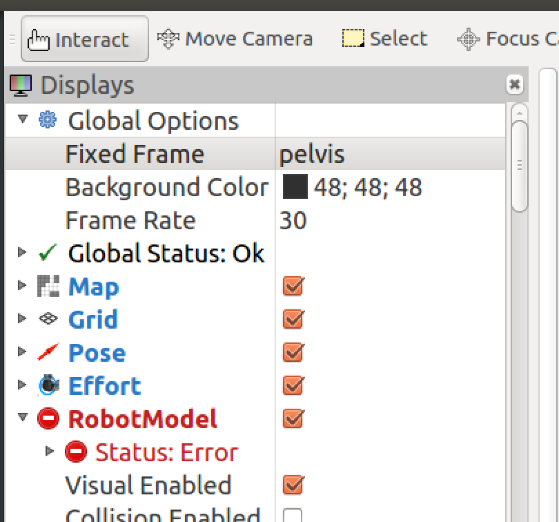

#RVIZ-Tutorial

##Install the RVIZ Repository
RVIZ is not shipped with ROS by default. 
To install it do the following

```sudo apt-get install ros-indigo-rviz```

If you are on another version of ROS do the following

```sudo apt-get install ros-<ROS-DISTRO>-rviz```

Where <ROS-DISTRO> is the flavor of ROS you are using.

Alternativly you can install RVIZ from source

```rosdep install rviz```

Followed by

```rosmake rviz```

## Starting the RVIZ interface

To start the interface you need to do the following with `roscore` running in the background

```source /opt/ros/indigo/setup.bash```

If the flavor of ROS that you are using is not `indigo` you will need to replace the `indigo` directory with the name of the flavor you are using.

Start RVIZ with the following command

```rosrun rviz rviz```

`rosrun` is the tool we use to start ROS nodes. RVIZ is the name of the node and the second rviz is the specific path to the launch file.


##Using RVIZ with your project

Once your ROS simulation is running along with `roscore` in the background you will be able to visualize what the robot is seeing in RVIZ.

On first load the robot will nto be visible. To be able to use the robot model within the RVIZ enviorment you will need to initalize the robot frame within the global options.

For some simulations like the [SRCSIM](https://bitbucket.org/osrf/srcsim) you need to set the `Fixed Frame` to `pelvis`. If the project your working on is setup correctly there shouldn't be a problem initalizing RVIZ to the simulation running in the background.



